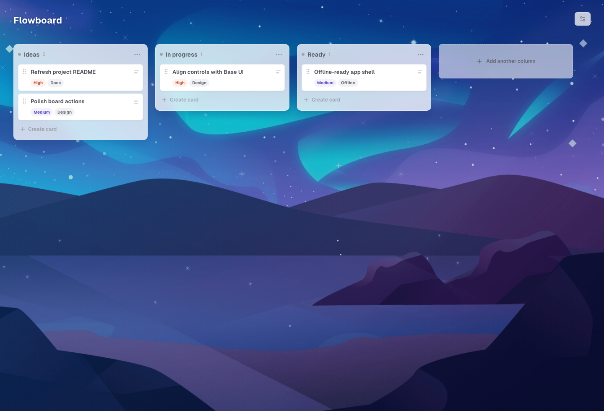

# Flowboard

Flowboard is a focused local-first workflow board for organizing columns, cards, priorities, tags, rich notes, and board backgrounds.



## Features

- Create, rename, reorder, and remove workflow columns.
- Create, edit, move, and delete cards.
- Add rich card content with Markdown-friendly formatting, links, code blocks, lists, blockquotes, and images.
- Assign Low, Medium, or High priority to cards.
- Create reusable board tags and assign them to cards.
- Manage board backgrounds with bundled presets or secure image URLs.
- Save boards locally in the browser, with optional local SQLite persistence for development and self-hosted local runs.
- Load the production app shell offline after the PWA service worker has cached it.

## Setup

Dependencies:

- Node 24
- npm

Install packages:

```bash
npm install
```

### `npm run dev`

Runs the local Node server, the SQLite database, and Vite in development mode. Open the local URL printed in the terminal to view the app.

The complete board state is saved to browser storage first and mirrored to the local SQLite API at `/api/board` when that API is available.

### `npm run dev:static`

Runs Vite without the local API. This matches the static Vercel deployment: each visitor's board is saved in their browser storage.

### `npm start`

Compiles the local TypeScript server, then serves the production build and the SQLite API locally. To create a production app build that connects to that local API, run:

```bash
npm run build:local
```

### `npm run test`

Launches the Vitest runner in watch mode.

### `npm run test:run`

Runs the test suite once.

### `npm run build`

Type-checks the app and local TypeScript server, emits the compiled server to `dist-server`, and builds the production app to `dist`.

## Storage

Flowboard is local-first. Browser storage is the source of truth for interactive editing, so the board remains usable even when the optional API is unavailable.

When using `npm run dev` or `npm start` with a local API build, the complete board state is also saved locally in `data/flowboard.db`: columns, card order, card content, priorities, tags, and the selected background. Existing browser storage is migrated automatically when the database is empty.

To create a backup, stop the server and copy:

```text
data/flowboard.db
```

## Offline PWA Behavior

The production build includes a web app manifest and service worker. After the app has loaded successfully once, the service worker caches the app shell and bundled assets so Flowboard can reopen offline.

Offline editing continues through browser storage. If `VITE_BOARD_API_URL` points at a local SQLite API and that API is unavailable, Flowboard keeps the local board intact and does not block edits. Bundled backgrounds are available offline; custom remote image URLs depend on the browser cache and the remote host.

## Deploying to Vercel

Import the repository in Vercel and deploy it with the included `vercel.json`. Vercel runs `npm run build` and publishes the static `dist` folder.

The hosted portfolio version intentionally uses browser storage only. SQLite depends on a persistent local filesystem, which Vercel Functions do not provide. If shared cross-device storage is needed later, connect an authenticated hosted database API and set `VITE_BOARD_API_URL` at build time.
