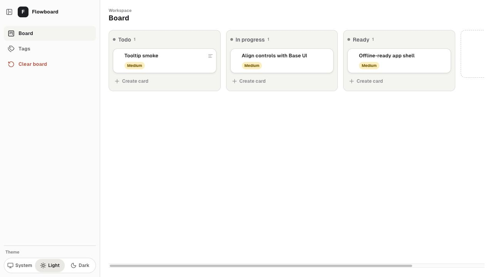

# Flowboard

Flowboard is a focused workflow board for organizing columns, cards,
priorities, tags, rich notes, and completed work history with durable
Prisma-backed persistence.



## UI History

- First version: [background-focused board](public/flowboard-screenshot-v1-background.png)
- Second version: [dark app-shell board](public/flowboard-screenshot-v2-app-shell.jpg)
- Latest version: [light app-shell board](public/flowboard-screenshot-latest.jpg)

## Features

- Create, rename, reorder, and remove workflow columns.
- Create, edit, move, and delete cards.
- Add rich card content with Markdown-friendly formatting, links, task lists, code blocks, lists, blockquotes, alignment, and images.
- Assign Low, Medium, or High priority to cards.
- Create reusable board tags and assign them to cards.
- Track active work cycles and completed work history.
- Sign in with Supabase Auth for durable user-owned boards.
- Use a responsive app shell with a collapsible sidebar, board actions, and system/light/dark theme controls.
- Persist board data through structured Prisma tables, using SQLite locally and
  Supabase Postgres in production.

## Setup

Dependencies:

- Node 24
- npm

Install packages:

```bash
npm install
```

Copy the example environment file for local database and server configuration:

```bash
cp .env.example .env
```

Initialize the local SQLite database before the first durable development run:

```bash
npm run db:migrate:sqlite
```

Flowboard uses the same Prisma data model in every durable mode:

- Local development uses the Node API, Prisma, and SQLite.
- Production uses Supabase Auth, the Node API, Prisma, and Supabase Postgres.

For the full runtime matrix, including which mode to use locally, in
production, with auth, without auth, with SQLite, and with Postgres, see
[Flowboard Running Modes](RUNNING_MODES.md).

### `npm run dev`

Runs the local Node server and Vite in development mode. Open the local URL
printed in the terminal to view the app.

By default, no-auth local work saves the board through Prisma SQLite at the
canonical board API, `/api/boards/default`. The server resolves a fixed local
development principal only for SQLite development runs.

When Supabase browser environment values are configured, the app shows a
Supabase magic-link sign-in flow and loads authenticated board data from
`/api/boards/default`. Authenticated saves are sent to `/api/boards/:id`.

### `npm run dev:static`

Runs Vite without the local API. Use this only for quick UI rendering checks;
durable product behavior requires the Prisma API from `npm run dev` or
`npm start`.

### `npm start`

Compiles the local TypeScript server, then serves the production build and the
Prisma API locally. To create a production app build for local serving, run:

```bash
npm run build:local
```

For a no-auth SQLite production-bundle smoke test, set
`FLOWBOARD_LOCAL_DEV_AUTH=true` on the server. This flag is ignored for Postgres
runs.

### `npm run test`

Launches the Vitest runner in watch mode.

### `npm run test:run`

Runs the test suite once.

### `npm run build`

Type-checks the app and local TypeScript server, emits the compiled server to `dist-server`, and builds the production app to `dist`.

## Database and Auth Setup

Flowboard uses Supabase Auth for production identity and Prisma for app-owned
data. Prisma owns Flowboard tables such as profiles, projects, boards, columns,
cards, tags, card-tag assignments, active work cycles, and completed work
history. Prisma does not manage Supabase's internal `auth` schema.

Generate Prisma clients:

```bash
npm run db:generate
```

Local SQLite development uses:

```bash
PRISMA_PROVIDER=sqlite
DATABASE_URL=file:./data/flowboard.local.db
```

No-auth local development still uses the same board endpoints as production:
`/api/projects`, `/api/boards/default`, and `/api/boards/:id`.

Run local schema generation and migration commands:

```bash
npm run db:generate:sqlite
npm run db:migrate:sqlite
npm run db:studio:sqlite
```

`db:migrate:sqlite` creates the SQLite file and its parent directory when they
do not exist, then applies the tracked migrations.

Production Supabase Postgres uses:

```bash
PRISMA_PROVIDER=postgresql
DATABASE_URL=postgresql://...
SUPABASE_URL=https://your-project-ref.supabase.co
SUPABASE_PUBLISHABLE_KEY=...
VITE_SUPABASE_URL=https://your-project-ref.supabase.co
VITE_SUPABASE_PUBLISHABLE_KEY=...
VITE_SUPABASE_GOOGLE_OAUTH_ENABLED=true
VITE_SUPABASE_APPLE_OAUTH_ENABLED=false
VITE_SUPABASE_AVATAR_BUCKET=flowboard-profile-avatars
```

Apply production migrations with:

```bash
npm run db:deploy:postgres
```

The browser `VITE_*` Supabase values are public client configuration. Keep
database URLs, service-role keys, and any privileged Supabase secrets server-side
only.

### Profile Avatar Storage

Flowboard stores profile avatar files in Supabase Storage and saves the public
URL plus object path on the app-owned profile record. The default bucket is:

```text
flowboard-profile-avatars
```

You can override it for a deployment with:

```text
VITE_SUPABASE_AVATAR_BUCKET=your-avatar-bucket
```

Create the bucket as a public Supabase Storage bucket so uploaded avatars can be
displayed through the public URL returned by the Supabase client. Avatar object
paths use this convention:

```text
<supabase-user-id>/avatar-<unique-id>.<extension>
```

Client-side validation accepts PNG, JPG, WebP, and GIF images up to 5 MB. When a
user replaces or removes an uploaded avatar, Flowboard clears the saved profile
reference and attempts to remove the previous object from the configured bucket.

### Social OAuth Setup

Flowboard uses one sign-in screen for new and returning users. Email magic links
remain available as the fallback, and social sign-in starts Supabase OAuth for
configured providers.

Public provider flags:

```bash
VITE_SUPABASE_GOOGLE_OAUTH_ENABLED=true
VITE_SUPABASE_APPLE_OAUTH_ENABLED=false
```

Google is enabled by default unless `VITE_SUPABASE_GOOGLE_OAUTH_ENABLED=false`.
Apple stays disabled until `VITE_SUPABASE_APPLE_OAUTH_ENABLED=true` because
Apple setup usually needs an Apple Developer account, service identifier,
provider secret, and stable HTTPS redirect URLs.

In Supabase Dashboard, configure Auth URL settings before testing OAuth:

```text
http://127.0.0.1:5173
http://localhost:5173
```

Add future deployed URLs before testing OAuth on Vercel or production:

```text
https://your-project.vercel.app
https://your-production-domain.com
```

Google OAuth setup:

- Create a Google OAuth web client in Google Cloud / Google Auth Platform.
- Add local and deployed app origins, such as `http://127.0.0.1:5173`.
- Add the Supabase Auth callback URL as an authorized redirect URI:
  `https://your-project-ref.supabase.co/auth/v1/callback`.
- Enable the Google provider in Supabase Auth and enter the Google client ID
  and client secret.

Apple OAuth setup:

- Configure Sign in with Apple in an Apple Developer account.
- Create the required service identifier and provider secret for web OAuth.
- Add the Supabase Auth callback URL:
  `https://your-project-ref.supabase.co/auth/v1/callback`.
- Plan to validate Apple with a stable HTTPS app URL. Local development can keep
  the Apple button disabled until these production-style URLs are ready.

Manual verification checklist:

- Email: request a magic link and confirm the app recognizes the returned
  Supabase session.
- Google: click "Continue with Google", complete provider consent, return to
  Flowboard, and confirm the authenticated board loads.
- Apple: when enabled, click "Continue with Apple", complete provider consent,
  return to Flowboard, and confirm the authenticated board loads.
- Board data: after any successful sign-in method, create or edit a card and
  confirm authenticated persistence works after refresh.

## Storage

Flowboard stores durable board data in Prisma-backed databases. Local
development uses SQLite, and production authenticated deployments use Supabase
Postgres.

When using `npm run dev` or `npm start` with Prisma SQLite, the complete board
state is saved locally in structured tables in `data/flowboard.local.db`:
columns, card order, card content, priorities, tags, active work cycle, and
completed work history.

To create a local SQLite backup, stop the server and copy:

```text
data/flowboard.local.db
```

Authenticated persistence loads durable board data from the authenticated API
and saves through Prisma-backed structured tables.

## PWA Shell

The production build includes a web app manifest and service worker. After the
app has loaded successfully once, the service worker caches the app shell and
bundled assets so Flowboard can reopen offline.

The service worker is for app-shell availability. Board data remains a
database-backed product concern and is saved only after the Prisma API confirms
persistence.

## Deploying to Vercel

Deploy Flowboard as an app shell plus an authenticated Node API runtime backed
by Supabase Postgres. The included `vercel.json` builds the browser app with
`npm run build` and publishes `dist`.

For production persistence, deploy the Node API runtime with Supabase Auth
verification, Prisma, and Supabase Postgres. Set `VITE_FLOWBOARD_API_URL` when
the browser should call an API origin other than the current site origin.

Flowboard includes Vercel Web Analytics and Speed Insights instrumentation.
Enable both products for the Vercel project before treating analytics as fully
configured:

```bash
vercel project web-analytics <project-name>
vercel project speed-insights <project-name>
```

You can also enable them from the Vercel dashboard. After the next deployment,
open a preview and confirm the browser console has no analytics-related Content
Security Policy violations, the analytics and vitals network requests succeed,
and Vercel-managed routes such as `/_vercel/insights/*` and
`/_vercel/speed-insights/*` are not served as the SPA `index.html`. After
traffic is generated, confirm Web Analytics receives page views and Speed
Insights receives vitals in Vercel.
